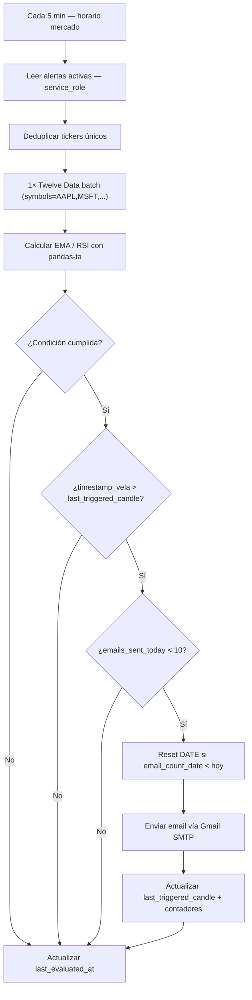
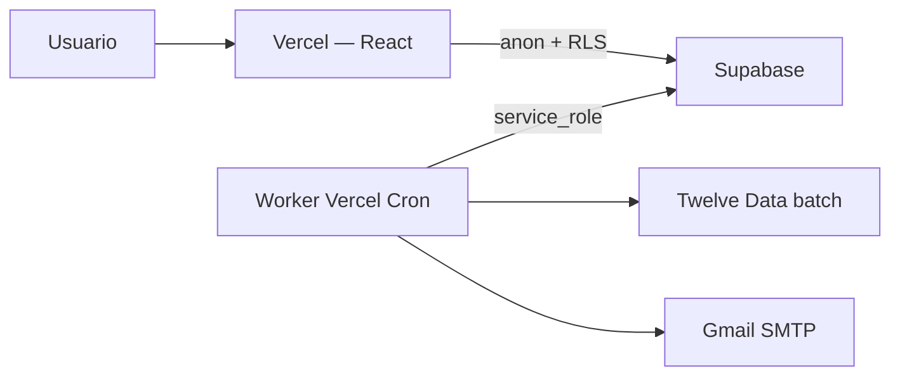

# Stock Alerts — Documento de Arquitectura

Plataforma web de análisis técnico automatizado que monitorea el mercado bursátil de EE. UU. con datos de baja latencia (~15 min de retraso en plan gratuito). Los usuarios registrados seleccionan tickers y configuran condiciones técnicas (cruces EMA, umbrales RSI) para recibir alertas por correo cuando el mercado cumpla esas condiciones.

---

## Alcance del MVP

| Decisión | Valor |
|----------|-------|
| Audiencia | Tú + conocidos (hoy ~1 usuario activo) |
| Tickers por usuario | Máx. **15 símbolos únicos** |
| Alertas por ticker | Máx. **5 alertas activas** por símbolo |
| Enforcement de límites | **Frontend + trigger PostgreSQL** |
| Idioma | **Español** (panel, emails y logs del worker) |

---

## Stack

| Capa | Tecnología | Rol |
|------|------------|-----|
| Base de datos + Auth | **Supabase** (PostgreSQL + RLS) | Usuarios, alertas, códigos de invitación |
| Frontend | **React + Vite** → **Vercel** | Panel de configuración; variables `VITE_*` |
| Worker | **TypeScript** serverless → **Vercel Cron** (`api/cron/evaluate`) | Polling, indicadores, emails |
| Datos de mercado | **Twelve Data** | Velas de **15 minutos** |
| Email | **Gmail SMTP** | Máx. **10 correos por alerta por día** |

### Backend mínimo en v1

El frontend habla **directamente con Supabase** (`@supabase/supabase-js`, clave `anon`, sujeta a RLS). No hay FastAPI. El worker es una **función cron** en Vercel con secretos server-side (`service_role`, SMTP, Twelve Data).

---

## Estructura del repositorio

```
finanzas-Alarma/
├── frontend/              # React + Vite → Vercel
├── api/cron/              # Worker serverless (Vercel Cron)
├── lib/                   # EMA, RSI, evaluador, Supabase store
├── worker/                # Python — solo desarrollo local (legacy)
├── supabase/migrations/
├── vercel.json            # Cron cada 5 min
└── .env.example
```

---

## Autenticación y registro

- **Método:** email + contraseña (Supabase Auth).
- **Registro restringido:** códigos de invitación de **un solo uso** en tabla `invite_codes`.
- El formulario de signup valida el código antes de llamar a `signUp()` y lo marca como usado tras registro exitoso.
- **Frontend:** clave `anon` + políticas RLS (`user_id = auth.uid()`).
- **Worker:** clave **`service_role`** en variables **server-side de Vercel** (función cron), nunca en `VITE_*` ni en el bundle del frontend.

---

## Alertas: tipos y presets

### Tipos soportados

- Cruces de **EMA** (alcista / bajista).
- **Precio vs media** (SMA o EMA): cierre cruza la línea de la media.
- Umbrales de **RSI** (sobreventa / sobrecompra).

### Presets (velas de 15 min)

| ID | Nombre en UI | Lógica |
|----|--------------|--------|
| `ema_cross_bull` | Cruce alcista rápido | EMA(9) cruza **arriba** EMA(21) |
| `ema_cross_bear` | Cruce bajista rápido | EMA(9) cruza **abajo** EMA(21) |
| `golden_cross` | Golden Cross | EMA(50) cruza **arriba** EMA(200) |
| `death_cross` | Death Cross | EMA(50) cruza **abajo** EMA(200) |
| `rsi_oversold` | RSI sobreventa | RSI(period) **< threshold** (defaults: 14 / 30; editables en panel) |
| `rsi_overbought` | RSI sobrecompra | RSI(period) **> threshold** (defaults: 14 / 70; editables en panel) |
| `custom` | Personalizado | Regla EMA, **precio vs media**, o RSI (no combinadas) |

En modo **custom**, el usuario elige timeframe **`15min`** o **`1day`**. Configura: períodos EMA + dirección de cruce; **precio vs SMA/EMA** + período + dirección; o período RSI + umbral + operador (`<` / `>`).

Ejemplo alerta temprana (gráfico diario 1Y): `timeframe=1day`, `params={ "type": "price_ma", "ma_type": "sma", "period": 12, "direction": "up" }`.

Los presets RSI guardan `params` como `{ "period": N, "threshold": N }` (sin `operator`; lo define el preset). Alertas existentes con `params: {}` usan los defaults 14 / 30 / 70.

---

## Esquema de datos

### Tabla `alerts`

| Campo | Tipo | Descripción |
|-------|------|-------------|
| `id` | `UUID` PK | Identificador |
| `user_id` | `UUID` FK | Propietario |
| `ticker` | `TEXT` | Símbolo (ej. `AAPL`) |
| `preset_or_custom` | `TEXT` | Preset o `custom` |
| `timeframe` | `TEXT` | `15min` (default) o `1day` |
| `params` | `JSONB` | Parámetros (EMA, price_ma, RSI, etc.) |
| `active` | `BOOLEAN` | Alerta habilitada |
| `emails_sent_today` | `INTEGER` | Contador diario (default 0) |
| `email_count_date` | **`DATE`** | Fecha del contador diario (ver sección de cuotas) |
| `last_triggered_candle` | **`TIMESTAMPTZ`** | **Candle-lock:** timestamp de la vela que disparó la última notificación |
| `last_evaluated_at` | `TIMESTAMPTZ` | Última evaluación del worker |

### Tabla `alert_firings`

Registro de cada email enviado para la bandeja de **disparos** del panel (persiste hasta borrado manual del usuario).

| Campo | Tipo | Descripción |
|-------|------|-------------|
| `id` | `UUID` PK | Identificador |
| `user_id` | `UUID` | Propietario (mismo patrón v1 que `alerts`) |
| `alert_id` | `UUID` FK nullable | Alerta origen; `ON DELETE SET NULL` si se elimina la regla |
| `ticker` | `TEXT` | Snapshot del ticker |
| `preset_or_custom` | `TEXT` | Snapshot del tipo |
| `params` | `JSONB` | Snapshot de parámetros |
| `timeframe` | `TEXT` | `15min` o `1day` |
| `candle_timestamp` | `TIMESTAMPTZ` | Vela que disparó |
| `sent_at` | `TIMESTAMPTZ` | Hora del envío |
| `label` | `TEXT` | Etiqueta legible (snapshot) |

- Panel (anon): **SELECT** + **DELETE**.
- Worker (`service_role`): **INSERT** tras email exitoso.

### Tabla `invite_codes`

| Campo | Tipo | Descripción |
|-------|------|-------------|
| `code` | `TEXT` PK | Código de invitación |
| `used_at` | `TIMESTAMPTZ` | Cuándo se canjeó |
| `used_by` | `UUID` FK | Usuario que lo usó |

### Límites en base de datos

- Trigger: máx. **15 tickers únicos** activos por `user_id`.
- Trigger: máx. **5 alertas activas** por (`user_id`, `ticker`).

---

## Worker: polling y horario

| Parámetro | Valor |
|-----------|-------|
| Intervalo de polling | Cada **5 minutos** |
| Horario de mercado | Lun–vie **9:30–16:00 EST** |
| Feriados NYSE (v1) | **No considerados** — solo día de semana + franja horaria |
| Timeframe de análisis | Presets: **15 min**. Custom: **15 min** o **diario** |

El worker se ejecuta en **Vercel Cron** cada 5 minutos (`vercel.json`). `MarketScheduler` omite el ciclo fuera de horario de mercado.

---

## 1. Consultas en bloque (batching) — Twelve Data

### Problema sin batching

- Mercado abierto: 6,5 h = 390 min → **78 ciclos/día** (cada 5 min).
- Con **15 tickers** consultados uno a uno: `78 × 15 = 1.170` peticiones/día.
- Límite free de Twelve Data: **800 req/día** y **8 req/min**.
- Sin batching se supera la cuota diaria y el worker falla por rate limiting en el primer minuto del ciclo.

### Solución: una petición por ciclo

El worker **no** itera ticker por ticker contra la API. En cada ciclo:

1. Lee todas las alertas activas (vía `service_role`).
2. **Deduplica** símbolos únicos (máx. 15).
3. Agrupa alertas por `timeframe` y llama **una petición batch por intervalo** (máx. 2: `15min` y `1day`):

   ```
   symbols=AAPL,MSFT,...&interval=15min
   symbols=AAPL,...&interval=1day
   ```

4. Parsea la respuesta multi-símbolo y calcula indicadores localmente con `pandas` / `pandas-ta`.

### Consumo resultante

| Métrica | Valor |
|---------|-------|
| Peticiones por ciclo | **1–2** (por intervalo activo) |
| Peticiones por día | **~78–156** |
| Cuota free Twelve Data | 800/día → **margen amplio** |
| Rate limit 8 req/min | **1 req/ciclo** → sin riesgo |

> **Nota:** El batching elimina la necesidad de lógicas complejas de caché en Docker para cumplir el free tier. La caché de velas queda descartada como requisito de arquitectura en v1.

---

## 2. Bloqueo por estampa de vela (candle-lock)

### Problema

- Análisis en velas de **15 min**; polling cada **5 min**.
- Si una condición se cumple en el minuto 5 de la vela actual, el worker envía correo.
- En los minutos 10 y 15 de la **misma vela**, la condición sigue siendo verdadera → **3 correos idénticos** por vela sin control.

### Solución: campo `last_triggered_candle`

Regla de disparo:

```
condición_cumplida
  AND timestamp_vela_actual > last_triggered_candle
  AND emails_sent_today < 10
  → Disparar email
  → Actualizar last_triggered_candle = timestamp_vela_actual
  → INSERT alert_firings (disparo para la UI)
```

- `last_triggered_candle` es **obligatorio** en el esquema (nullable hasta el primer disparo).
- Garantiza **como máximo un email por vela de 15 min** por alerta, independientemente del intervalo de polling.
- Complementa (no reemplaza) el tope de 10 emails/alerta/día.
- Si el INSERT de `alert_firings` falla tras el email, el worker deja log de error y **no** reenvía el correo.

---

## 3. Reinicio de cuotas diarias de email

### Campo `email_count_date` — tipo `DATE`

Usar **`DATE`** estrictamente (no `TIMESTAMPTZ`) para simplificar el reinicio del contador.

Lógica en el worker al evaluar cada alerta:

```sql
-- Si la fecha del mercado (o UTC) no coincide con email_count_date:
UPDATE alerts
SET emails_sent_today = 0,
    email_count_date = CURRENT_DATE
WHERE id = :alert_id
  AND (email_count_date IS NULL OR email_count_date < CURRENT_DATE);
```

Luego evaluar si `emails_sent_today < 10` antes de enviar.

Evita comparaciones con horas/minutos/segundos y hace el reset idempotente en una sola consulta.

---

## 4. Rol del worker en Supabase

| Cliente | Clave | RLS |
|---------|-------|-----|
| Frontend (Vercel) | `anon` | **Activo** — cada usuario solo ve sus alertas |
| Worker (Vercel Cron) | **`service_role`** | **Bypass** — lectura/escritura global para batch y actualización de contadores |

### Requisitos de seguridad

- `SUPABASE_SERVICE_ROLE_KEY` solo en **variables server-side de Vercel** (y `.env` local para pruebas). No commitear.
- Nunca exponer `service_role` en variables `VITE_*` ni en el repositorio.
- El worker solo necesita: leer alertas activas, actualizar `last_triggered_candle`, `emails_sent_today`, `email_count_date`, `last_evaluated_at`.

---

## Flujo del worker (por ciclo)



---

## Flujo del usuario



---

## Límites y cuotas consolidados

| Recurso | Límite | Mecanismo |
|---------|--------|-----------|
| Twelve Data | 800 req/día, 8 req/min | **1 batch/ciclo → 78 req/día** |
| Gmail SMTP | ~500 emails/día (cuenta personal) | **10 emails/alerta/día** + candle-lock |
| Tickers por usuario | 15 únicos | Trigger PostgreSQL + UI |
| Alertas por ticker | 5 activas | Trigger PostgreSQL + UI |
| Emails por vela | 1 | **`last_triggered_candle`** |

---

## Despliegue

| Componente | Dónde |
|------------|-------|
| Frontend | **Vercel** (`frontend/` + `api/`, env `VITE_*` + secretos cron) |
| Base de datos + Auth | **Supabase** (proyecto cloud) |
| Worker | **Vercel Cron** → `api/cron/evaluate` |
| Migraciones | `supabase/migrations/` aplicadas al proyecto Supabase |

---

## Fuera de alcance en v1

- FastAPI u otro backend HTTP.
- Feriados y early close del NYSE.
- Combinación de condiciones EMA + RSI en una sola alerta.
- Caché de velas (innecesaria con batching).
- i18n / inglés.

---

## Decisiones confirmadas (pendientes cerrados)

- [x] **5 alertas máx. por ticker**
- [x] **Vercel** para el frontend
- [x] **Batching** Twelve Data (1 req/ciclo) en lugar de caché
- [x] **Candle-lock** con `last_triggered_candle`
- [x] **`email_count_date` como `DATE`**
- [x] **Worker con `service_role`** en Vercel Cron (ADR 001)
